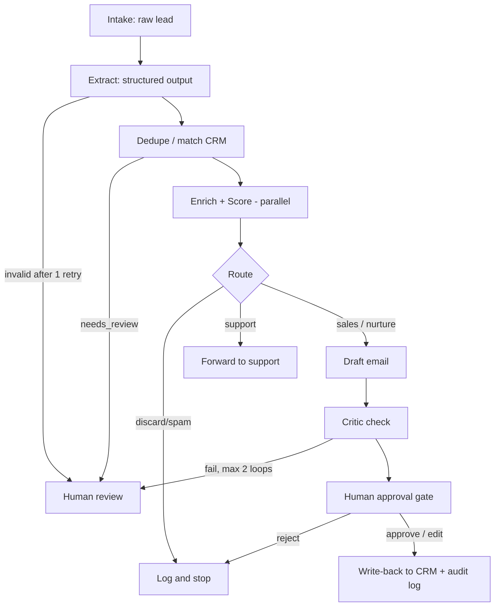

# LeadFlow Architecture (Step 1)

## User story
As a sales rep, I want new leads cleaned, deduplicated, scored and drafted, so I only review and approve.

## Inputs / outputs
- **Input:** raw inbound lead (form JSON or pasted email text)
- **Output:** created/updated CRM record, logged interaction, approved follow-up email, full audit trail

## Out of scope (v1)
Real email sending to live addresses, multi-language leads, inbound phone/chat, billing.

## Workflow

## Design decisions: workflow vs agent

| Step | Type | Why |
|---|---|---|
| Extract | LLM call + schema | Fixed task, validate with Pydantic |
| Dedupe | Rules first, LLM only for ambiguous | Cheap, deterministic, testable |
| Score | Rules + LLM rationale | Must be explainable |
| Route | Rules + LLM classifier | Thresholds are predictable |
| Draft | Generator + critic loop (bounded) | Only step needing real flexibility |
| Approve | Human gate | Nothing irreversible without a person |
| Write-back | Plain code | Idempotent, transactional, no LLM |

## Safety principles
1. No CRM write or email without approval.
2. LLM never gets write credentials; only the write-back module does.
3. All lead text is untrusted input (prompt injection).
4. Every run has max steps, max cost, and a trace ID.

## Success metrics
Extraction >= 90%, dedupe >= 95%, zero unapproved writes, cost/lead < $0.02, every run traceable.
